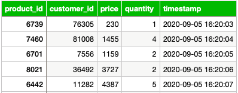

## 1. Tools and Technologies

- OLTP database: MySQL
- NoSQL database: MongoDB
- Production Data Warehouse: DB2 on Cloud
- Staging Data Warehouse: PostgreSQL
- Big data platform: Hadoop
- Big data analytics platform: Spark
- BI Dashboard: IBM Cognos Analytics
- Data Pipelines: Apache Airflow

## 2. Process

SoftCart's online presence is primarily through its website, which customers access using a variety of devices like laptops, mobiles and tablets.

All the catalog data of the products is stored in the MongoDB NoSQL server.

All the transactional data like inventory and sales are stored in the MySQL database server.

SoftCart's webserver is driven entirely by these two databases.

Data is periodically extracted from these two databases and put into the staging data warehouse running on PostgreSQL.

The production data warehouse is on the cloud instance of IBM DB2 server.

BI teams connect to the IBM DB2 for operational dashboard creation. IBM Cognos Analytics is used to create dashboards.

SoftCart uses Hadoop cluster as its big data platform where all the data is collected for analytics purposes.

Spark is used to analyse the data on the Hadoop cluster.

To move data between OLTP, NoSQL and the data warehouse, ETL pipelines are used and these run on Apache Airflow.

## 3. OLTP Database

- MySQL 8.0.22
- phpMyAdmin 5.0.4

**Design a table named sales_data.**



**Create the sales_data table in sales database.**

```sql
CREATE TABLE sales_data (
    product_id INT NOT NULL,
    customer_id INT NOT NULL,
    price DECIMAL(10, 2) NOT NULL,
    quantity INT NOT NULL,
    sales_timestamp DATETIME NOT NULL
);
```

**Import data from [oltpdata.csv](oltpdata.csv)**


**Create index named `ts` on `sales_timestamp` column**

**Write a bash script to export data.**

[Link to script](datadump.sh)

Because run MySQL in Docker Container, I need to created script named [exec_script.sh](exec_script.sh) to copy and run it in container environment.

Then, all you need to do is

```bash
sudo chmod +x datadump.sh exec_script.sh
```

Then run

```bash
./exec_script.sh
```

## 4. Querying data in NoSQL Database


## 5. Data Warehouse Design and Setup

**Create a grouping sets query using the columns country, category, totalsales.**

```SQL
SELECT country, category, SUM(f.amount)
FROM
	"FactSales" f
JOIN
	"DimCountry" c ON c.countryid = f.countryid
JOIN
	"DimCategory" ca ON ca.categoryid = f.categoryid
GROUP BY GROUPING SETS (
	(country, category),
	(country),
	(category),
	()
);
```

**Create a rollup query using the columns year, country, and totalsales.**

```SQL
SELECT year, country, SUM(amount)
FROM
	"FactSales" f
JOIN "DimDate" d ON f.dateid = d.dateid
JOIN "DimCountry" c ON f.countryid = c.countryid
GROUP BY ROLLUP (year, country);
```

**Create a cube query using the columns year, country, and average sales.**

```SQL
SELECT year, country, AVG(amount)
FROM
    "FactSales" f
JOIN "DimDate" d ON f.dateid = d.dateid
JOIN "DimCountry" c ON f.countryid = c.countryid
GROUP BY CUBE (year, country);
```

## 6. BI Dashboard using IBM Cognos Analytics

[Link to dashboard](https://ap1.ca.analytics.ibm.com/bi/?perspective=dashboard&pathRef=.my_folders%2FIBM%2BDE%2BCapstone%2BProject&action=view&mode=dashboard&subView=model00000193015a564f_00000000)

[PDF of dashboard](IBM%20DE%20Capstone%20Project.pdf)


